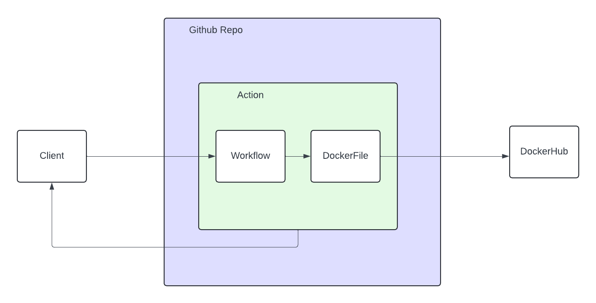

# Project 4

## Overview

This project will create a container image from a Dockerfile that will use nginx to host a website on the users local machine. It will be created within WSL using Docker Desktop. This project will also build a docker image on a successful push that can be viewed in the linked repository below. Tags will be included with semantic versioning

## How To

- First, Docker must be installed
- To install Docker, download the required file from their website depending on your computers OS
- Any requried dependencies will need to be downloaded as well. I use Windows so I have installed Docker Desktop and WSL
- To build an image, first setup a Dockerfile
- Run the command `docker build -t [name]:[tag]` where [name] is the image name and [tag] is its version
- To run the container, use the command `docker run` followed by any options, then the port number, and the name of the image.
- I used the command `docker run -d -p 80:80 [name]` to run my container
- To view the website, open a browser and enter the localhost IP. If a specific port was specified it should be entered as well.

## Repo Creation

- Login into Docker Hub
- Choose the create repository option
- Fill out the details
- Finish creating

## How to Authenticate 

- To authenticate to Docker Hub, first run `docker login`
- `docker login` requires sudo or root user to run
- It will prompt for your information if successful
- Once finished, use `docker logout` to exit

## How to Push

- Create a public repository on Docker Hub
- Before pushing, a tag is needed
- Make sure you are logged in as well
- Use the command `docker tag [IMAGE NAME] [YOUR USER NAME]/[REPO NAME]`
- In the command line, run `docker push [YOUR USER NAME]/[REPO NAME]`

## Docker Hub Link

https://hub.docker.com/r/mangan21/project4

## Github Secrets

- To set a secret, access the repository settings
- Ener the name of the secret and its value
- In this project I set two secrets, DOCKER_USERNAME and DOCKER_PASSWORD which hold the respective information

## Github Workflow

- Workflows runs a job(s) when a specified event is triggered
- In this project, on a push event including a new tag, a job will run that builds a docker image and pushes it to my docker hub repository alongside updating the latest image.
- In my project, the variables referencing my docker username and password along with my repository would need to be changed if someone else were to use it

## Tag Generation

- To generate a tag in Github, first create a new tag using `git tag vX.X.X` with X being the major, minor, and patch numbers in that order.
- Once the tag is created, push it to the repository using `git push origin vX.X.X`
- This will add the tag to your repository and the github workflow will add the new tag to Docker Hub

## Continuous Integration Diagram

